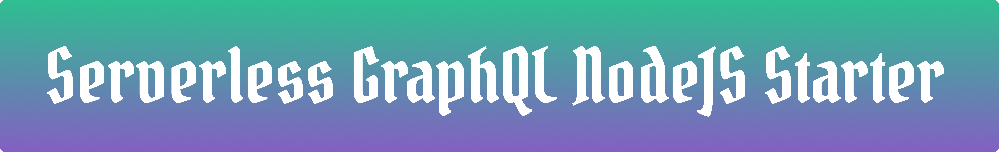

<h1 align="center">
    
 </h1>

# Serverless GraphQL NodeJS Starter 

This is a basic boilerplate to kickstart your Serverless GraphQL projects with AWS Lambda. There is also a [TypeScript version](https://github.com/AmoDinho/serverless-graphql-typescript-starter/blob/master/README.md) if you prefer!

It is powered by [`Apollo-Server-Lambda`](https://github.com/apollographql/apollo-server/tree/master/packages/apollo-server-lambda) and uses the [Serverless Framework](https://serverless.com/) to deploy it to AWS.

This is hugely inspired by the starter that [Anomaly Innovations](https://github.com/AnomalyInnovations/serverless-nodejs-starter ) created. The project was cloned from it. 

## Prerequistes 

* [An AWS Account](https://aws.amazon.com/)
* [A configured AWS CLI](https://serverless.com/framework/docs/providers/aws/guide/credentials/)
* [Serverless Framework installed on your machine](https://serverless.com/framework/docs/providers/aws/guide/installation/)
* [NodeJS](nodejs.org) 

Note this project uses [Yarn](https://yarnpkg.com). 

## How to get started

Install all its dependancies:

```sh
$ yarn install
```

Then you should be able to invoke the Lambda locally:

```sh
$ yarn offline
```
Go to http://localhost:3000/dev/graphql to access the GraphQL Playground.

To deploy to AWS run the following command:

```sh
$ yarn deploy
```

This should be a good start to be able to move on and do whatever you gotta do meet business requirements.  

## Contributing

Contributions are most welcome!!
